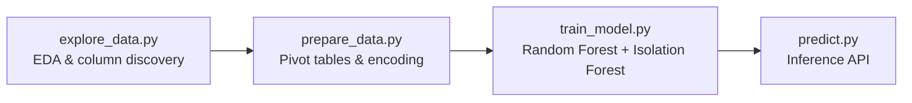

# ML Component — Technical Summary

## 1. Full ML Pipeline

The pipeline is a three-stage process, executed in order:



| Stage | Script | Purpose |
|---|---|---|
| **1 — Explore** | [explore_data.py](file:///c:/Users/HP/Desktop/amod/model/explore_data.py) | Scans CSVs, prints column names, antibiotic distributions, phenotype value counts |
| **2 — Prepare** | [prepare_data.py](file:///c:/Users/HP/Desktop/amod/model/prepare_data.py) | Reads raw CSVs, filters by quality thresholds, builds a genome × antibiotic pivot matrix (1=Resistant, 0=Susceptible, −1=Unknown), saves `feature_matrix_<species>.csv` and `antibiotics_<species>.pkl` |
| **3 — Train** | [train_model.py](file:///c:/Users/HP/Desktop/amod/model/train_model.py) | Trains one **RandomForestClassifier** per antibiotic per species (300 trees, balanced class weights). Also trains one **IsolationForest** anomaly detector per species. Saves [.pkl](file:///c:/Users/HP/Desktop/amod/model/anomaly_ecoli.pkl) model files, feature lists, and [model_results.json](file:///c:/Users/HP/Desktop/amod/model/model_results.json) |
| **4 — Predict** | [predict.py](file:///c:/Users/HP/Desktop/amod/model/predict.py) | Loads all models at import time. Exposes [predict_resistance()](file:///c:/Users/HP/Desktop/amod/model/predict.py#74-152) for the backend |

> [!IMPORTANT]
> The model is **phenotype-to-phenotype**, not genotype-to-phenotype. Each feature is the known resistance status of a *different* antibiotic, used to cross-predict the target antibiotic. A gene-presence vector from a C++ scanner would need to be mapped to this phenotype dictionary format before calling [predict_resistance](file:///c:/Users/HP/Desktop/amod/model/predict.py#74-152).

---

## 2. File Structure

All files reside in [model/](file:///c:/Users/HP/Desktop/amod/model).

### Python Scripts

| File | Purpose |
|---|---|
| [explore_data.py](file:///c:/Users/HP/Desktop/amod/model/explore_data.py) | One-time EDA utility — auto-detects CSVs, prints shapes, columns, antibiotic/phenotype distributions |
| [prepare_data.py](file:///c:/Users/HP/Desktop/amod/model/prepare_data.py) | Reads raw species CSVs, filters antibiotics by min-resistant threshold, builds pivot feature matrices |
| [train_model.py](file:///c:/Users/HP/Desktop/amod/model/train_model.py) | Trains per-antibiotic Random Forest classifiers + per-species Isolation Forest anomaly detectors |
| [predict.py](file:///c:/Users/HP/Desktop/amod/model/predict.py) | Inference module — loads all models at import, exposes [predict_resistance()](file:///c:/Users/HP/Desktop/amod/model/predict.py#74-152) |

### Raw Data (3 species CSVs)

| File | Size |
|---|---|
| [Ecoli.csv](file:///c:/Users/HP/Desktop/amod/model/Ecoli.csv) | 1.6 MB |
| `Clostridioides difficile.csv` | 1.6 MB |
| `Staphylococcus aureus.csv` | 107 KB |

### Processed Data

| Pattern | Count | Description |
|---|---|---|
| `feature_matrix_<species>.csv` | 3 | Genome × antibiotic pivot matrices |
| `antibiotics_<species>.pkl` | 3 | List of valid antibiotics per species |

### Trained Models ([.pkl](file:///c:/Users/HP/Desktop/amod/model/anomaly_ecoli.pkl) via joblib)

| Pattern | Count | Description |
|---|---|---|
| `model_<species>_<antibiotic>.pkl` | **25** | RandomForestClassifier (one per antibiotic) |
| `features_<species>_<antibiotic>.pkl` | **25** | Feature column list for each model |
| `anomaly_<species>.pkl` | 3 | IsolationForest anomaly detectors |
| `all_features_<species>.pkl` | 3 | Full feature list for anomaly detection |
| [antibiotic_list.pkl](file:///c:/Users/HP/Desktop/amod/model/antibiotic_list.pkl) | 1 | Master antibiotic list |

### Evaluation Outputs

| Pattern | Count | Description |
|---|---|---|
| `importance_<species>_<antibiotic>.png` | 25 | Feature importance bar charts |
| [model_results.json](file:///c:/Users/HP/Desktop/amod/model/model_results.json) | 1 | AUC, MCC, CV scores, confusion matrices |

---

## 3. Trained Model Format

- **Format:** Python pickle ([.pkl](file:///c:/Users/HP/Desktop/amod/model/anomaly_ecoli.pkl)) serialized via **joblib**
- **Algorithm:** `sklearn.ensemble.RandomForestClassifier`
  - `n_estimators=300`, `class_weight="balanced"`, `max_features="sqrt"`, `min_samples_leaf=2`
- **Anomaly detector:** `sklearn.ensemble.IsolationForest`
  - `n_estimators=100`, `contamination=0.05`
- **Total model files:** 25 classifiers + 3 anomaly detectors = **28 [.pkl](file:///c:/Users/HP/Desktop/amod/model/anomaly_ecoli.pkl) files**

---

## 4. Inference Function

The exact function from [predict.py](file:///c:/Users/HP/Desktop/amod/model/predict.py#L74-L151):

```python
def predict_resistance(phenotype_dict: dict, species: str = "ecoli") -> dict:
    """
    Args:
        phenotype_dict: known resistance values
            {"ciprofloxacin": 1, "ampicillin": 0}
            1=Resistant, 0=Susceptible, -1=Unknown

        species: "ecoli", "saureus", or "cdiff"

    Returns:
        JSON-compatible dict matching agreed contract
    """
```

---

## 5. Input Specification

| Property | Value |
|---|---|
| **Type** | Python [dict](file:///c:/Users/HP/Desktop/amod/model/predict.py#74-152) (antibiotic name → int) |
| **Values** | `1` = Resistant, `0` = Susceptible, `-1` = Unknown |
| **Species param** | `"ecoli"`, `"saureus"`, or `"cdiff"` |
| **Missing keys** | Default to `-1` (unknown) for classifier features, `0` for anomaly detector |

### Feature Counts Per Species

| Species | Classifier Features | Antibiotics Modeled |
|---|---|---|
| E. coli | 13 (other antibiotics, excl. target) | 14 |
| S. aureus | 5 (other antibiotics, excl. target) | 6 |
| C. difficile | 4 (other antibiotics, excl. target) | 5 |

> [!WARNING]
> The input is **NOT** a raw gene vector like `[1,0,1,0,0]`. It is a **dictionary of known phenotypic resistance** per antibiotic. If the C++ genome scanner produces a positional gene vector, a **mapping layer** must translate gene positions to antibiotic names before calling this function.

### Example Input

```python
phenotype_dict = {
    "ciprofloxacin": 1,
    "ampicillin": 0,
    "gentamicin": -1
}
result = predict_resistance(phenotype_dict, species="ecoli")
```

---

## 6. Output Specification

The function returns a JSON-serializable [dict](file:///c:/Users/HP/Desktop/amod/model/predict.py#74-152):

```json
{
  "species": "Escherichia coli",
  "predictions": {
    "gentamicin": {
      "prediction": "Resistant",
      "confidence": 0.823,
      "resistant_probability": 0.823
    },
    "ceftriaxone": {
      "prediction": "Susceptible",
      "confidence": 0.912,
      "resistant_probability": 0.088
    },
    "trimethoprim": {
      "prediction": "Resistant",
      "confidence": 0.671,
      "resistant_probability": 0.671
    },
    "meropenem": "..."
  },
  "anomaly": false,
  "anomaly_score": 0.142,
  "shap_values": {
    "gentamicin": {
      "ciprofloxacin": 0.1234,
      "ampicillin": 0.0987
    }
  },
  "warnings": ["⚠️  3rd gen cephalosporin resistance — possible ESBL producer"],
  "confidence": 0.785
}
```

| Field | Type | Description |
|---|---|---|
| `species` | `str` | Full species name |
| `predictions` | `dict[str, dict]` | Per-antibiotic predictions with label, confidence, and probability |
| `anomaly` | `bool` | `true` if Isolation Forest flags the input as anomalous |
| `anomaly_score` | `float` | Raw anomaly decision score |
| `shap_values` | `dict[str, dict]` | Top-5 feature importances per antibiotic (SHAP proxy) |
| `warnings` | `list[str]` | Clinical safety alerts for critical resistance patterns |
| `confidence` | `float` | Average confidence across all predictions |

> [!NOTE]
> Meropenem is listed in the `SAFETY_RULES` dictionary but is **not** among the currently trained E. coli models. It exists as a C. difficile antibiotic in the config but was filtered out during data preparation (insufficient samples). Only antibiotics with trained models will appear in `predictions`.

---

## 7. Python Dependencies

```
numpy
pandas
scikit-learn
joblib
matplotlib
```

No deep learning frameworks are used. All models are scikit-learn Random Forests/Isolation Forests.

---

## 8. Loading the Model

```python
import sys, os
# Add the model directory to the path
sys.path.insert(0, os.path.abspath("model"))
os.chdir("model")  # Required — models load from cwd

from predict import predict_resistance
# All 28 .pkl files are loaded automatically at import time
```

> [!CAUTION]
> [predict.py](file:///c:/Users/HP/Desktop/amod/model/predict.py) loads models using **relative paths** (e.g. `"model_ecoli_gentamicin.pkl"`). The working directory **must** be `model/` when importing, or model loading will fail silently (species will be skipped).

---

## 9. Batch vs. Single Prediction

The model supports **single prediction only**. The function [predict_resistance()](file:///c:/Users/HP/Desktop/amod/model/predict.py#74-152) processes one genome (phenotype dictionary) at a time. For batch inference, loop over inputs:

```python
results = [predict_resistance(sample, species="ecoli") for sample in batch]
```

Internally, numpy arrays are reshaped to [(1, -1)](file:///c:/Users/HP/Desktop/amod/model/predict.py#74-152) — confirming single-sample design.

---

## 10. Backend Integration Code

```python
import sys, os

# Setup paths
MODEL_DIR = os.path.abspath("model")
sys.path.insert(0, MODEL_DIR)
original_dir = os.getcwd()
os.chdir(MODEL_DIR)

from predict import predict_resistance

os.chdir(original_dir)  # Restore working directory


# FastAPI endpoint example
from fastapi import FastAPI
app = FastAPI()

@app.post("/predict")
async def predict(payload: dict):
    """
    Expected payload:
    {
        "species": "ecoli",
        "phenotype": {
            "ciprofloxacin": 1,
            "ampicillin": 0,
            "gentamicin": -1
        }
    }
    """
    species = payload.get("species", "ecoli")
    phenotype = payload.get("phenotype", {})
    result = predict_resistance(phenotype, species=species)
    return result
```

---

## Model Performance Summary

### E. coli (14 models)

| Antibiotic | AUC | MCC | Samples |
|---|---|---|---|
| ceftriaxone | 0.712 | 0.282 | 124 |
| ampicillin | 0.706 | 0.284 | 714 |
| ceftazidime | 0.692 | 0.233 | 794 |
| piperacillin/tazobactam | 0.690 | 0.097 | 711 |
| cefotaxime | 0.678 | 0.205 | 669 |
| amoxicillin/clavulanic acid | 0.659 | 0.226 | 463 |
| cefuroxime | 0.647 | 0.134 | 528 |
| chloramphenicol | 0.592 | 0.215 | 113 |
| ciprofloxacin | 0.549 | −0.01 | 793 |
| trimethoprim/sulfamethoxazole | 0.548 | 0.006 | 437 |
| gentamicin | 0.538 | 0.067 | 772 |
| tetracycline | 0.531 | −0.071 | 103 |
| nalidixic acid | 0.348 | −0.125 | 137 |
| trimethoprim | 0.205 | −0.524 | 124 |

### C. difficile (5 models — best performers)

| Antibiotic | AUC | MCC | Samples |
|---|---|---|---|
| azithromycin | **0.995** | 0.980 | 1592 |
| clarithromycin | **0.991** | 0.979 | 1591 |
| ceftriaxone | **0.928** | 0.716 | 242 |
| clindamycin | 0.871 | 0.630 | 290 |
| moxifloxacin | 0.861 | 0.633 | 1591 |

### S. aureus (6 models — all AUC = 0.5)

All S. aureus models have AUC = 0.5 and MCC = 0.0, indicating **no predictive power** (random guessing). Sample sizes are very small (60–71).
